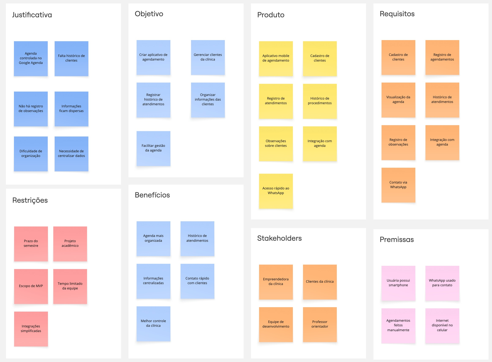

# Especificações do Projeto

Pré-requisitos: <a href="1-Documentação de Contexto.md"> Documentação de Contexto</a>

Esta seção apresenta a definição do problema identificado junto à empreendedora parceira e a proposta de solução desenvolvida pela equipe, considerando principalmente a perspectiva do usuário. O objetivo é estruturar os requisitos e características do sistema de forma organizada, garantindo que o produto final atenda às necessidades reais do contexto de uso.

Atualmente, o processo de agendamento da clínica de estética é realizado *exclusivamente* por meio do Whatsapp e do Google Agenda, sem a existência de um sistema próprio para gerenciamento de clientes, histórico de atendimentos ou organização de informações relevantes sobre cada sessão. Essa forma de gerenciamento limita o controle das informações de clientes e dificulta o acompanhamento do histórico de procedimentos realizados.

Diante desse cenário, propõe-se o desenvolvimento de um sistema de agendamento voltado inicialmente para a empreendedora responsável pela clínica, permitindo não apenas a organização dos horários de atendimento, mas também o cadastro e gerenciamento das clientes, incluindo informações como histórico de sessões, observações, dados de contato e datas importantes. O sistema também será pensado de forma escalável, permitindo a inclusão futura de novas modalidades de serviços estéticos ou sua adaptação para uso em outras clínicas.

## Arquitetura e Tecnologias

### Arquitetura da Solução

A solução proposta seguirá uma arquitetura **cliente-servidor**, composta por três principais camadas: aplicação mobile (frontend), API backend e banco de dados. Essa estrutura permite separar responsabilidades, facilitando a manutenção, escalabilidade e evolução futura do sistema.

O **aplicativo mobile** será responsável pela interface com o usuário, permitindo que a empreendedora visualize sua agenda, realize novos agendamentos e gerencie informações das clientes.

A **API backend** será responsável por processar as requisições da aplicação, aplicar as regras de negócio do sistema e realizar a comunicação com o banco de dados.

O **banco de dados** armazenará as informações persistentes do sistema, como dados das clientes, histórico de atendimentos, observações e agendamentos realizados.

Além disso, o sistema prevê integrações com ferramentas já utilizadas pela empreendedora, de forma a facilitar a adoção da solução. Entre essas integrações estão o Google Agenda, utilizado atualmente para o controle dos horários, e o WhatsApp, principal canal de comunicação com as clientes.

A integração com o *Google Agenda* permitirá sincronizar os agendamentos cadastrados no sistema com a agenda utilizada pela empreendedora, evitando conflitos de horários e mantendo a organização dos atendimentos.

Já a integração com o *WhatsApp* permitirá iniciar conversas diretamente com as clientes a partir do aplicativo. Essa funcionalidade será implementada por meio da geração automática de links de conversa com mensagens pré-preenchidas, facilitando o envio de confirmações de agendamento ou lembretes de atendimento. Essa abordagem foi escolhida por ser simples e adequada ao escopo de um Produto Mínimo Viável (MVP), não exigindo integração direta com a API oficial do WhatsApp.

A arquitetura proposta também foi planejada considerando a possibilidade de expansão futura, permitindo a inclusão de novas modalidades de serviços estéticos ou a adaptação do sistema para utilização em outras clínicas.

### Tecnologias Utilizadas

As tecnologias escolhidas para o desenvolvimento do projeto foram definidas com base nas ferramentas estudadas pela equipe durante o curso, bem como na facilidade de desenvolvimento e manutenção da solução.

- Aplicação Mobile: React Native
- Backend: C# .NET (a definir)
- Banco de Dados: PostgreSQL ou MySQL (a definir)

#### Integrações

- Google Calendar
- WhatsApp

#### Ferramentas de Desenvolvimento

- Git e GitHub
- Visual Studio Code (a definir)
- Postman (a definir)

## Project Model Canvas

O Project Model Canvas (PMC) é uma ferramenta visual utilizada para organizar e comunicar de forma clara os principais elementos de um projeto. Por meio desse modelo é possível estruturar informações como justificativa, objetivos, benefícios esperados, produto final, partes interessadas, recursos e restrições.

Essa ferramenta facilita a visualização geral da proposta do projeto, permitindo compreender rapidamente o problema identificado, a solução proposta e os resultados esperados.

## Requisitos

As tabelas a seguir apresentam os requisitos funcionais e requisitos não funcionais que definem o escopo da solução proposta. Esses requisitos foram identificados a partir da análise do contexto da empreendedora parceira e das histórias de usuário elaboradas durante a fase de levantamento de requisitos.

Para definir a prioridade de implementação, foi aplicada a técnica MoSCoW, amplamente utilizada em gerenciamento de projetos de software para priorização de requisitos. Essa técnica classifica os requisitos em quatro níveis:
- Must Have (Alta prioridade) – requisitos essenciais para o funcionamento do sistema.
- Should Have (Média prioridade) – requisitos importantes, mas que não impedem o funcionamento básico do sistema.
- Could Have (Baixa prioridade) – funcionalidades desejáveis, porém não essenciais para o MVP.
- Won’t Have (não incluído no escopo atual) – funcionalidades previstas para versões futuras.

Considerando o escopo de **Produto Mínimo Viável (MVP)** do projeto, foram priorizados principalmente os requisitos classificados como Must Have, garantindo o funcionamento básico do sistema de agendamento e gestão de clientes.

### Requisitos Funcionais

Os requisitos funcionais descrevem as funcionalidades que o sistema deverá oferecer aos usuários.

| ID     | Descrição do Requisito                                                          | Prioridade |
| ------ | ------------------------------------------------------------------------------- | ---------- |
| RF-001 | Permitir que a usuária cadastre novas clientes no sistema                       | ALTA       |
| RF-002 | Permitir visualizar a lista de clientes cadastradas                             | ALTA       |
| RF-003 | Permitir editar as informações de uma cliente cadastrada                        | ALTA       |
| RF-004 | Permitir registrar observações ou anotações sobre a cliente                     | MÉDIA      |
| RF-005 | Permitir registrar um novo agendamento para uma cliente                         | ALTA       |
| RF-006 | Permitir visualizar os agendamentos cadastrados na agenda                       | ALTA       |
| RF-007 | Permitir registrar o histórico de atendimentos realizados                       | ALTA       |
| RF-008 | Permitir consultar o histórico de atendimentos de uma cliente                   | ALTA       |
| RF-009 | Permitir cadastrar diferentes tipos de serviços ou procedimentos                | MÉDIA      |
| RF-010 | Permitir visualizar os dados de contato da cliente                              | ALTA       |
| RF-011 | Permitir iniciar uma conversa com a cliente via WhatsApp a partir do aplicativo | MÉDIA      |
| RF-012 | Permitir sincronizar os agendamentos com o Google Agenda                        | MÉDIA      |
| RF-013 | Permitir registrar a data de aniversário da cliente                             | BAIXA      |

### Requisitos não Funcionais

Os requisitos não funcionais descrevem características técnicas e de qualidade que o sistema deverá possuir.

| ID      | Descrição do Requisito                                                                              | Prioridade |
| ------- | --------------------------------------------------------------------------------------------------- | ---------- |
| RNF-001 | O sistema deve funcionar em dispositivos móveis                                                     | ALTA       |
| RNF-002 | O sistema deve ser desenvolvido utilizando React Native                                             | ALTA       |
| RNF-003 | O backend da aplicação deve ser desenvolvido utilizando C# e .NET                                   | ALTA       |
| RNF-004 | O sistema deve armazenar os dados em banco de dados relacional                                      | ALTA       |
| RNF-005 | O sistema deve apresentar uma interface simples e intuitiva para facilitar o uso pela empreendedora | ALTA       |
| RNF-006 | O sistema deve responder às requisições do usuário em tempo adequado para uso cotidiano             | MÉDIA      |
| RNF-007 | O sistema deve permitir integração com serviços externos, como Google Agenda                        | MÉDIA      |
| RNF-008 | O sistema deve permitir iniciar comunicação com clientes via WhatsApp                               | MÉDIA      |
| RNF-009 | O sistema deve possibilitar a inclusão futura de novos tipos de serviços estéticos                  | BAIXA      |
| RNF-010 | O sistema deve permitir evolução futura para múltiplos usuários                                     | BAIXA      |

## Restrições

O desenvolvimento do projeto está sujeito a algumas restrições que limitam o escopo e as decisões técnicas da solução proposta. Essas restrições estão relacionadas principalmente ao contexto acadêmico do projeto, ao tempo disponível para desenvolvimento e ao objetivo de entrega de um **Produto Mínimo Viável (MVP)**.

A Tabela a seguir apresenta as principais restrições identificadas para o projeto.

| ID | Restrição                                                                                                                                                  |
| -- | ---------------------------------------------------------------------------------------------------------------------------------------------------------- |
| 01 | O projeto deverá ser desenvolvido e entregue dentro do período do semestre letivo da disciplina.                                                           |
| 02 | O sistema será desenvolvido inicialmente como um Produto Mínimo Viável (MVP), contendo apenas as funcionalidades essenciais.                           |
| 03 | Inicialmente haverá apenas uma usuária principal do sistema, a empreendedora responsável pela clínica.                                                     |
| 04 | O sistema será desenvolvido utilizando as tecnologias estudadas pela equipe, como React Native e C# com .NET.                                              |
| 05 | A integração com o WhatsApp será realizada apenas por meio de links de conversa com mensagens pré-preenchidas, não utilizando a API oficial da plataforma. |
| 06 | A integração com o Google Agenda será implementada de forma simplificada, considerando o escopo do projeto acadêmico.                                      |
| 07 | O sistema será projetado inicialmente para uma única clínica, podendo ser adaptado futuramente para outros estabelecimentos.                               |
| 08 | O desenvolvimento será realizado por uma equipe de estudantes, com tempo e recursos limitados.                                                             |

## Diagrama de Casos de Uso

O diagrama de casos de uso é o próximo passo após a elicitação de requisitos, que utiliza um modelo gráfico e uma tabela com as descrições sucintas dos casos de uso e dos atores. Ele contempla a fronteira do sistema e o detalhamento dos requisitos funcionais com a indicação dos atores, casos de uso e seus relacionamentos. 

As referências abaixo irão auxiliá-lo na geração do artefato “Diagrama de Casos de Uso”.

> **Links Úteis**:
> - [Criando Casos de Uso](https://www.ibm.com/docs/pt-br/elm/6.0?topic=requirements-creating-use-cases)
> - [Como Criar Diagrama de Caso de Uso: Tutorial Passo a Passo](https://gitmind.com/pt/fazer-diagrama-de-caso-uso.html/)
> - [Lucidchart](https://www.lucidchart.com/)
> - [Astah](https://astah.net/)
> - [Diagrams](https://app.diagrams.net/)

## Modelo ER (Projeto Conceitual)

O Modelo ER representa através de um diagrama como as entidades (coisas, objetos) se relacionam entre si na aplicação interativa.

Sugestão de ferramentas para geração deste artefato: LucidChart e Draw.io.

A referência abaixo irá auxiliá-lo na geração do artefato “Modelo ER”.

> - [Como fazer um diagrama entidade relacionamento | Lucidchart](https://www.lucidchart.com/pages/pt/como-fazer-um-diagrama-entidade-relacionamento)

## Projeto da Base de Dados

O projeto da base de dados corresponde à representação das entidades e relacionamentos identificadas no Modelo ER, no formato de tabelas, com colunas e chaves primárias/estrangeiras necessárias para representar corretamente as restrições de integridade.
