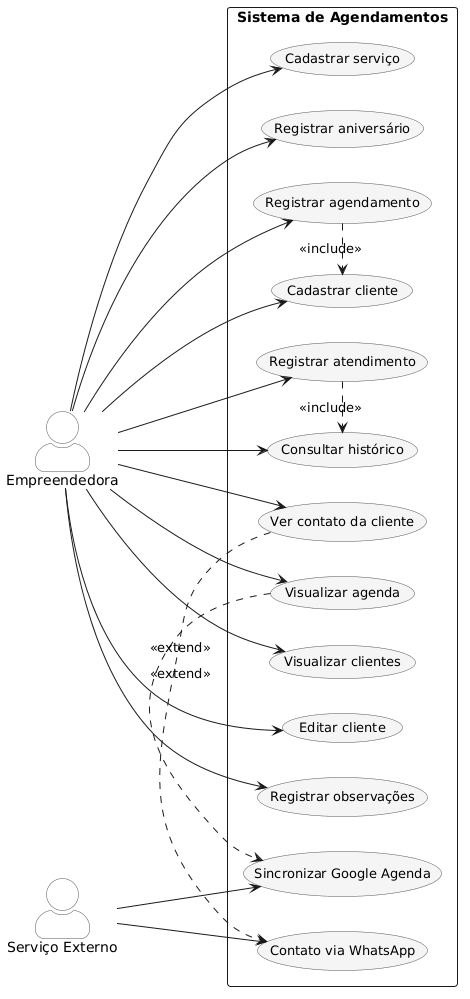
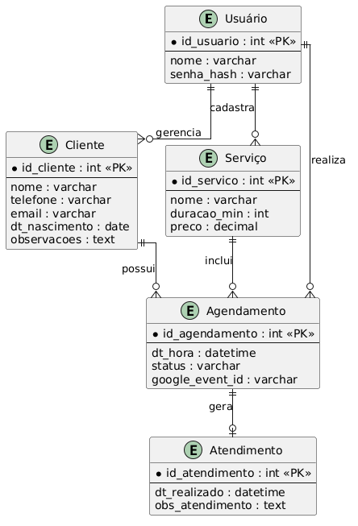
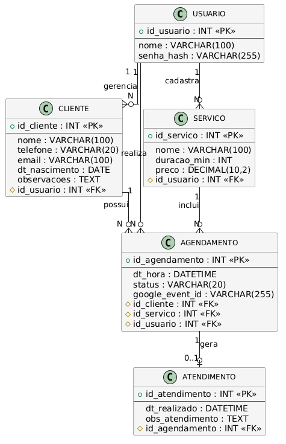
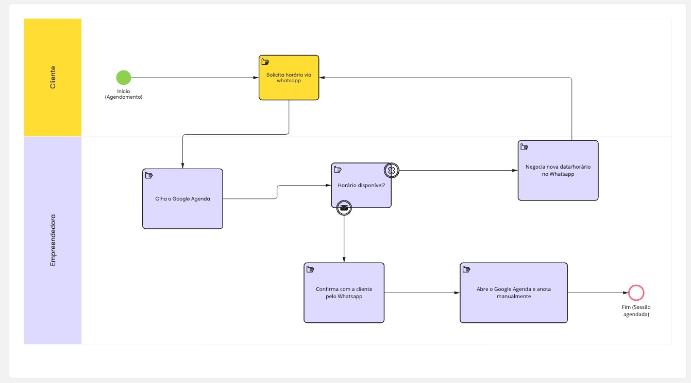
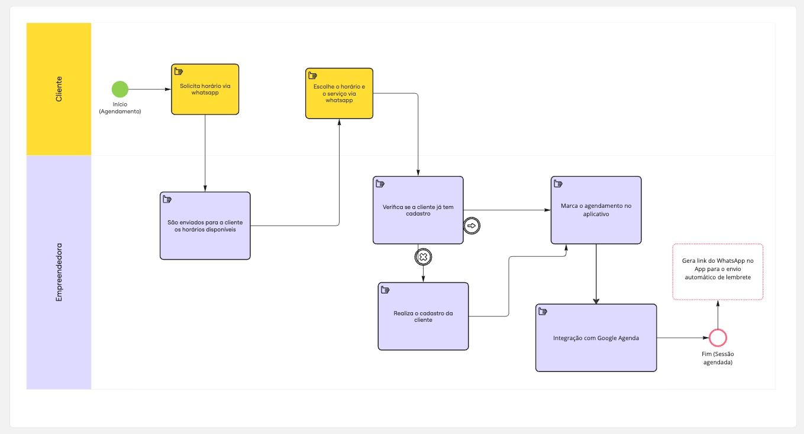
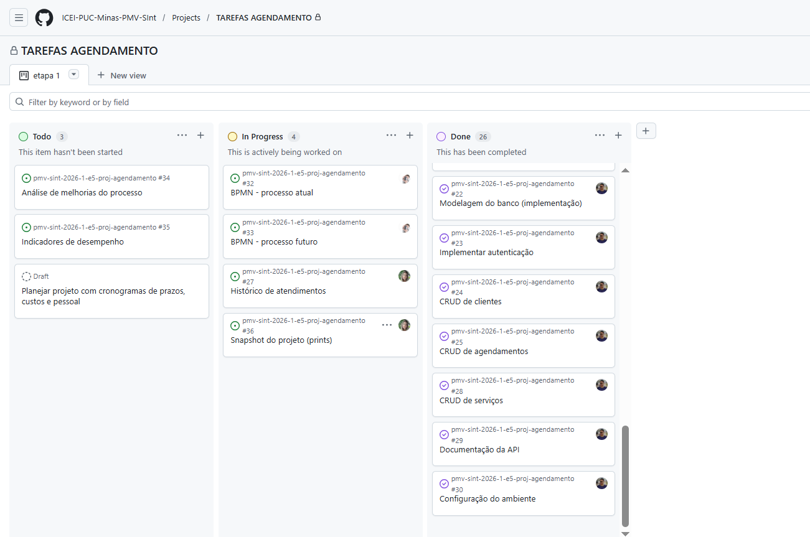
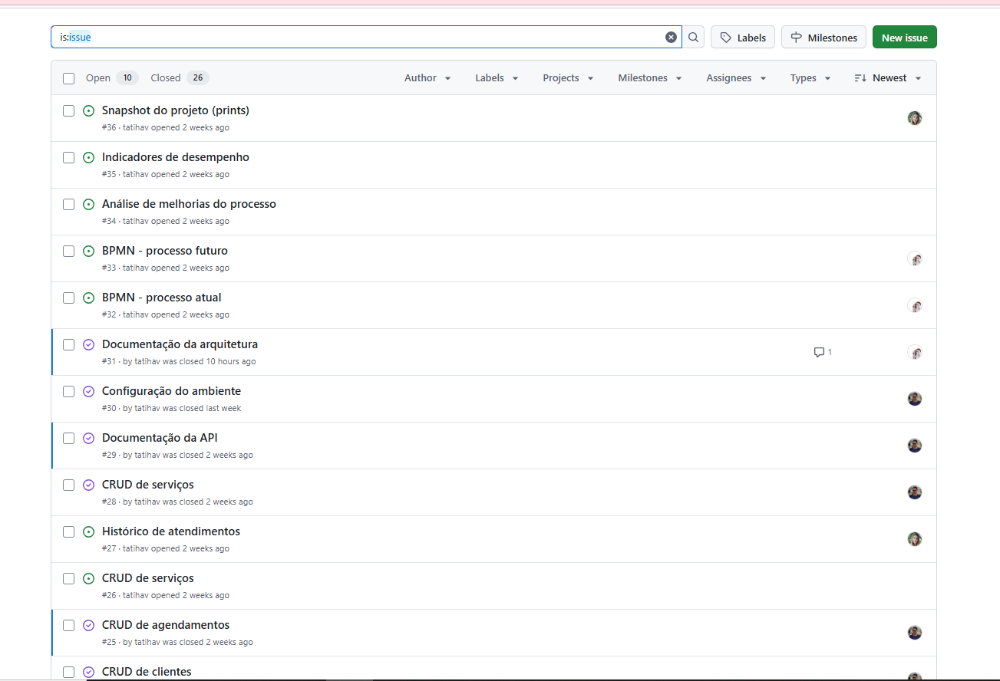
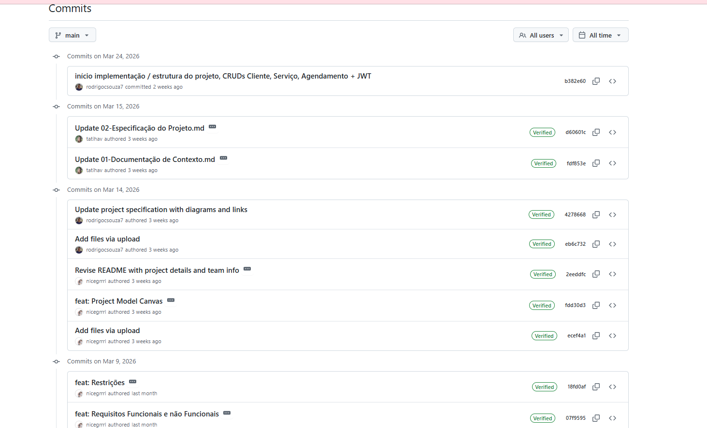

# Especificações do Projeto

Pré-requisitos: <a href="1-Documentação de Contexto.md"> Documentação de Contexto</a>

Esta seção apresenta a definição do problema identificado junto à empreendedora parceira e a proposta de solução desenvolvida pela equipe, considerando principalmente a perspectiva do usuário. O objetivo é estruturar os requisitos e características do sistema de forma organizada, garantindo que o produto final atenda às necessidades reais do contexto de uso.

Atualmente, o processo de agendamento da clínica de estética é realizado *exclusivamente* por meio do Whatsapp e do Google Agenda, sem a existência de um sistema próprio para gerenciamento de clientes, histórico de atendimentos ou organização de informações relevantes sobre cada sessão. Essa forma de gerenciamento limita o controle das informações de clientes e dificulta o acompanhamento do histórico de procedimentos realizados.

Diante desse cenário, propõe-se o desenvolvimento de um sistema de agendamento voltado inicialmente para a empreendedora responsável pela clínica, permitindo não apenas a organização dos horários de atendimento, mas também o cadastro e gerenciamento das clientes, incluindo informações como histórico de sessões, observações, dados de contato e datas importantes. O sistema também será pensado de forma escalável, permitindo a inclusão futura de novas modalidades de serviços estéticos ou sua adaptação para uso em outras clínicas.

## Personas
### Persona 1: Ivinah Sousa
Idade: 26 anos 
Profissão: Lash Designer e designer de sobrancelhas
Experiência na área: 5 anos
Tipo de negócio: Atendimento autônomo na área de estética

Perfil
Ivinah é uma profissional autônoma que trabalha com serviços de estética, principalmente extensão de cílios e design de sobrancelhas. Ela atende clientes mediante agendamento prévio e possui uma clientela majoritariamente recorrente. Em média, realiza cerca de três atendimentos por dia em horário comercial.

Atualmente, os agendamentos são feitos principalmente por meio de mensagens recebidas no WhatsApp e, ocasionalmente, pelo Instagram. Após combinar o horário com a cliente, ela registra manualmente o atendimento em sua agenda.

Objetivos: Organizar melhor sua agenda de atendimentos. Ter um registro centralizado das informações das clientes. Conseguir visualizar rapidamente os horários disponíveis. Acompanhar o histórico de procedimentos realizados pelas clientes.

Dificuldades: Precisa responder manualmente às mensagens de agendamento. Às vezes tem dificuldade em localizar horários disponíveis rapidamente. Já ocorreram conflitos de agendamento ou esquecimentos de registro. O histórico das clientes fica disperso nas conversas do WhatsApp.

Necessidades: Um sistema simples para registrar clientes e agendamentos. Visualizar a agenda de forma clara e organizada. Registrar o histórico de atendimentos das clientes. Facilitar a comunicação com as clientes para confirmação ou lembretes de atendimento.

### Persona 2 – Manicure Autônoma (Usuária Potencial)
Nome: Juliana Martins
Idade: 32 anos
Profissão: Manicure e pedicure autônoma
Experiência na área: 4 anos
Tipo de negócio: Atendimento domiciliar e em pequeno estúdio próprio

Perfil
Juliana é uma manicure autônoma que atende clientes mediante agendamento prévio. A maior parte de seus atendimentos ocorre durante o horário comercial, podendo variar conforme a disponibilidade das clientes. Assim como muitos profissionais da área da beleza, ela utiliza principalmente o WhatsApp para organizar seus horários e confirmar atendimentos.

Por não possuir um sistema próprio para gerenciamento de agenda e clientes, Juliana registra seus horários manualmente em agendas ou aplicativos genéricos, o que pode tornar a organização dos atendimentos mais difícil.

Objetivos: Organizar sua agenda de atendimentos de forma mais eficiente. Manter um cadastro atualizado das clientes. Registrar o histórico dos serviços realizados. Visualizar rapidamente os horários disponíveis para novos atendimentos.

Dificuldades: Controle manual dos agendamentos por meio de mensagens. Dificuldade em localizar rapidamente horários disponíveis. Falta de um local centralizado para registrar informações das clientes. Necessidade de procurar conversas antigas para lembrar procedimentos realizados.

Necessidades: Um sistema simples para cadastro de clientes. Visualização clara da agenda de atendimentos. Registro do histórico de serviços realizados. Facilidade para entrar em contato com as clientes.

### História de Usuário

| EU COMO (persona) | QUERO/PRECISO O QUE | PARA ... POR QUE |
|---|---|---|
| Empreendedora | cadastrar clientes no sistema | manter os dados das clientes organizados em um único lugar |
| Empreendedora | visualizar a lista de clientes cadastradas | encontrar rapidamente uma cliente quando precisar |
| Empreendedora | editar as informações de uma cliente | manter os dados das clientes sempre atualizados |
| Empreendedora | registrar observações sobre uma cliente | lembrar informações importantes para próximos atendimentos |
| Empreendedora | registrar um novo agendamento | organizar meus horários de atendimento |
| Empreendedora | visualizar minha agenda de atendimentos | identificar facilmente horários disponíveis e ocupados |
| Empreendedora | registrar o atendimento realizado | manter o histórico de procedimentos de cada cliente |
| Empreendedora | consultar o histórico de uma cliente | lembrar quais procedimentos ela já realizou |
| Empreendedora | visualizar o telefone da cliente no sistema | entrar em contato rapidamente quando necessário |
| Empreendedora | iniciar uma conversa com a cliente pelo WhatsApp | agilizar a comunicação sobre agendamentos ou confirmações |
| Empreendedora | cadastrar os tipos de serviços oferecidos | organizar melhor os procedimentos realizados no negócio |

## Arquitetura e Tecnologias

### Arquitetura da Solução

A solução proposta seguirá uma arquitetura **cliente-servidor**, composta por três principais camadas: aplicação mobile (frontend), API backend e banco de dados. Essa estrutura permite separar responsabilidades, facilitando a manutenção, escalabilidade e evolução futura do sistema.

O **aplicativo mobile** será responsável pela interface com o usuário, permitindo que a empreendedora visualize sua agenda, realize novos agendamentos e gerencie informações das clientes.

A **API backend** será responsável por processar as requisições da aplicação, aplicar as regras de negócio do sistema e realizar a comunicação com o banco de dados.

O **banco de dados** armazenará as informações persistentes do sistema, como dados das clientes, histórico de atendimentos, observações e agendamentos realizados.

Além disso, o sistema prevê integrações com ferramentas já utilizadas pela empreendedora, de forma a facilitar a adoção da solução. Entre essas integrações estão o Google Agenda, utilizado atualmente para o controle dos horários, e o WhatsApp, principal canal de comunicação com as clientes.

A integração com o *Google Agenda* permitirá sincronizar os agendamentos cadastrados no sistema com a agenda utilizada pela empreendedora, evitando conflitos de horários e mantendo a organização dos atendimentos.

Já a integração com o *WhatsApp* permitirá iniciar conversas diretamente com as clientes a partir do aplicativo. Essa funcionalidade será implementada por meio da geração automática de links de conversa com mensagens pré-preenchidas, facilitando o envio de confirmações de agendamento ou lembretes de atendimento. Essa abordagem foi escolhida por ser simples e adequada ao escopo de um Produto Mínimo Viável (MVP), não exigindo integração direta com a API oficial do WhatsApp.

A arquitetura proposta também foi planejada considerando a possibilidade de expansão futura, permitindo a inclusão de novas modalidades de serviços estéticos ou a adaptação do sistema para utilização em outras clínicas.

### Tecnologias Utilizadas

As tecnologias escolhidas para o desenvolvimento do projeto foram definidas com base nas ferramentas estudadas pela equipe durante o curso, bem como na facilidade de desenvolvimento e manutenção da solução.

- Aplicação Mobile: React Native
- Backend: C# .NET (a definir)
- Banco de Dados: PostgreSQL ou MySQL (a definir)

#### Integrações

- Google Calendar
- WhatsApp

#### Ferramentas de Desenvolvimento

- Git e GitHub
- Visual Studio Code (a definir)
- Postman (a definir)

## Project Model Canvas

O Project Model Canvas (PMC) é uma ferramenta visual utilizada para organizar e comunicar de forma clara os principais elementos de um projeto. Por meio desse modelo é possível estruturar informações como justificativa, objetivos, benefícios esperados, produto final, partes interessadas, recursos e restrições.

Essa ferramenta facilita a visualização geral da proposta do projeto, permitindo compreender rapidamente o problema identificado, a solução proposta e os resultados esperados.

## Requisitos

As tabelas a seguir apresentam os requisitos funcionais e requisitos não funcionais que definem o escopo da solução proposta. Esses requisitos foram identificados a partir da análise do contexto da empreendedora parceira e das histórias de usuário elaboradas durante a fase de levantamento de requisitos.

Para definir a prioridade de implementação, foi aplicada a técnica MoSCoW, amplamente utilizada em gerenciamento de projetos de software para priorização de requisitos. Essa técnica classifica os requisitos em quatro níveis:
- Must Have (Alta prioridade) – requisitos essenciais para o funcionamento do sistema.
- Should Have (Média prioridade) – requisitos importantes, mas que não impedem o funcionamento básico do sistema.
- Could Have (Baixa prioridade) – funcionalidades desejáveis, porém não essenciais para o MVP.
- Won’t Have (não incluído no escopo atual) – funcionalidades previstas para versões futuras.

Considerando o escopo de **Produto Mínimo Viável (MVP)** do projeto, foram priorizados principalmente os requisitos classificados como Must Have, garantindo o funcionamento básico do sistema de agendamento e gestão de clientes.

### Requisitos Funcionais

Os requisitos funcionais descrevem as funcionalidades que o sistema deverá oferecer aos usuários.

| ID     | Descrição do Requisito                                                          | Prioridade |
| ------ | ------------------------------------------------------------------------------- | ---------- |
| RF-001 | Permitir que a usuária cadastre novas clientes no sistema                       | ALTA       |
| RF-002 | Permitir visualizar a lista de clientes cadastradas                             | ALTA       |
| RF-003 | Permitir editar as informações de uma cliente cadastrada                        | ALTA       |
| RF-004 | Permitir registrar observações ou anotações sobre a cliente                     | MÉDIA      |
| RF-005 | Permitir registrar um novo agendamento para uma cliente                         | ALTA       |
| RF-006 | Permitir visualizar os agendamentos cadastrados na agenda                       | ALTA       |
| RF-007 | Permitir registrar o histórico de atendimentos realizados                       | ALTA       |
| RF-008 | Permitir consultar o histórico de atendimentos de uma cliente                   | ALTA       |
| RF-009 | Permitir cadastrar diferentes tipos de serviços ou procedimentos                | MÉDIA      |
| RF-010 | Permitir visualizar os dados de contato da cliente                              | ALTA       |
| RF-011 | Permitir iniciar uma conversa com a cliente via WhatsApp a partir do aplicativo | MÉDIA      |
| RF-012 | Permitir sincronizar os agendamentos com o Google Agenda                        | MÉDIA      |
| RF-013 | Permitir registrar a data de aniversário da cliente                             | BAIXA      |

### Requisitos não Funcionais

Os requisitos não funcionais descrevem características técnicas e de qualidade que o sistema deverá possuir.

| ID      | Descrição do Requisito                                                                              | Prioridade |
| ------- | --------------------------------------------------------------------------------------------------- | ---------- |
| RNF-001 | O sistema deve funcionar em dispositivos móveis                                                     | ALTA       |
| RNF-002 | O sistema deve ser desenvolvido utilizando React Native                                             | ALTA       |
| RNF-003 | O backend da aplicação deve ser desenvolvido utilizando C# e .NET                                   | ALTA       |
| RNF-004 | O sistema deve armazenar os dados em banco de dados relacional                                      | ALTA       |
| RNF-005 | O sistema deve apresentar uma interface simples e intuitiva para facilitar o uso pela empreendedora | ALTA       |
| RNF-006 | O sistema deve responder às requisições do usuário em tempo adequado para uso cotidiano             | MÉDIA      |
| RNF-007 | O sistema deve permitir integração com serviços externos, como Google Agenda                        | MÉDIA      |
| RNF-008 | O sistema deve permitir iniciar comunicação com clientes via WhatsApp                               | MÉDIA      |
| RNF-009 | O sistema deve possibilitar a inclusão futura de novos tipos de serviços estéticos                  | BAIXA      |
| RNF-010 | O sistema deve permitir evolução futura para múltiplos usuários                                     | BAIXA      |

## Restrições

O desenvolvimento do projeto está sujeito a algumas restrições que limitam o escopo e as decisões técnicas da solução proposta. Essas restrições estão relacionadas principalmente ao contexto acadêmico do projeto, ao tempo disponível para desenvolvimento e ao objetivo de entrega de um **Produto Mínimo Viável (MVP)**.

A Tabela a seguir apresenta as principais restrições identificadas para o projeto.

| ID | Restrição                                                                                                                                                  |
| -- | ---------------------------------------------------------------------------------------------------------------------------------------------------------- |
| 01 | O projeto deverá ser desenvolvido e entregue dentro do período do semestre letivo da disciplina.                                                           |
| 02 | O sistema será desenvolvido inicialmente como um Produto Mínimo Viável (MVP), contendo apenas as funcionalidades essenciais.                           |
| 03 | Inicialmente haverá apenas uma usuária principal do sistema, a empreendedora responsável pela clínica.                                                     |
| 04 | O sistema será desenvolvido utilizando as tecnologias estudadas pela equipe, como React Native e C# com .NET.                                              |
| 05 | A integração com o WhatsApp será realizada apenas por meio de links de conversa com mensagens pré-preenchidas, não utilizando a API oficial da plataforma. |
| 06 | A integração com o Google Agenda será implementada de forma simplificada, considerando o escopo do projeto acadêmico.                                      |
| 07 | O sistema será projetado inicialmente para uma única clínica, podendo ser adaptado futuramente para outros estabelecimentos.                               |
| 08 | O desenvolvimento será realizado por uma equipe de estudantes, com tempo e recursos limitados.                                                             |

## Diagrama de Casos de Uso

O diagrama de casos de uso é o próximo passo após a elicitação de requisitos, que utiliza um modelo gráfico e uma tabela com as descrições sucintas dos casos de uso e dos atores. Ele contempla a fronteira do sistema e o detalhamento dos requisitos funcionais com a indicação dos atores, casos de uso e seus relacionamentos. 

## Modelo ER (Projeto Conceitual)

O Modelo ER representa através de um diagrama como as entidades (coisas, objetos) se relacionam entre si na aplicação interativa.

## Projeto da Base de Dados

O projeto da base de dados corresponde à representação das entidades e relacionamentos identificadas no Modelo ER, no formato de tabelas, com colunas e chaves primárias/estrangeiras necessárias para representar corretamente as restrições de integridade.

## Processos de Negócio (BPMN)

*Business Process Model and Notation* (BPMN) ou, em português, Modelo e Notação de Processos de Negócio, trata-se de uma padronização técnica e visual amplamente adotada no mercado para mapear, documentar e explicar o passo a passo de como os fluxos de trabalho acontecem no dia a dia de uma organização.

Neste documento, a compreensão dos processos de negócio é fundamental para o desenvolvimento da aplicação. Identificar como o trabalho é feito atualmente ajuda a mapear limitações, gargalos e falhas operacionais, enquanto desenhar a situação futura estrutura e justifica como o novo sistema será inserido na rotina da clínica para resolver esses problemas.

Para essa documentação, utilizamos a notação BPMN simplificada para ilustrar o fluxo de Agendamento da clínica de estética.

### 1. Processo Atual

O cenário atual retrata a organização da empreendedora sem o uso de um sistema autoral. O processo depende do WhatsApp para comunicação e do Google Agenda para armazenamento do horário, o que não cria uma base de dados de clientes e dificulta recuperar o histórico.

#### Diagrama da Situação Atual

**Problemas identificados:**
- Retrabalho entre duas ferramentas que não conversam (Google Agenda e WhatsApp).
- Não há registro associando qual serviço foi feito, apenas o evento de horário na agenda.
- Histórico de pagamentos e procedimentos realizados fica disperso, gerando confusão se houver algum retorno da cliente meses depois.

### 2. Processo Futuro

O processo futuro retrata a introdução do nosso novo aplicativo móvel. Esse processo agora centraliza as informações. O sistema se torna a "fonte da verdade" não só para horários, mas para dados de serviços prestados e das clientes.

#### Diagrama da Situação Futura

**Benefícios Alcançados:**
- Os dados do cliente, histórico e agendamentos ficam atrelados ao mesmo lugar (Banco de Dados Central).
- Padronização e preenchimento ágil.
- Geração de informações para o Painel de Indicadores (Métricas).
## Planejamento do projeto

### Cronograma

O cronograma do projeto foi definido considerando as etapas necessárias para o desenvolvimento da solução, desde o levantamento de requisitos até a implementação do sistema e documentação final.

| Etapa | Período |
|------|--------|
Levantamento de requisitos e definição do problema | Março |
Modelagem do sistema e elaboração da documentação | Março |
Desenvolvimento do back-end e banco de dados | Abril |
Desenvolvimento do front-end (aplicação mobile) | Maio |
Testes e ajustes do sistema | Maio |
Finalização da documentação e entrega final | Junho |

---

### Custos

Por se tratar de um projeto acadêmico, não há custos diretos envolvidos no desenvolvimento da aplicação. As ferramentas utilizadas são gratuitas ou disponibilizadas no ambiente acadêmico.

| Item | Custo |
|------|------|
Desenvolvimento | R$ 0,00 |
Ferramentas (GitHub, VS Code, etc.) | R$ 0,00 |
Banco de dados | R$ 0,00 |
Infraestrutura | R$ 0,00 |

---

### Equipe

O desenvolvimento do projeto está sendo realizado por uma equipe de estudantes, com divisão de responsabilidades conforme as áreas de atuação no sistema.

| Integrante | Responsabilidade |
|-------------|--------------|
Alana Alves Maia| Desenvolvimento front-end e documentação|
Rodrigo da Costa Souza| Desenvolvimento front-end e apoio no back-end e banco de dados|
Tatiana Haveroth Barbosa | Desenvolvimento front-end e documentação |

## Snapshot do projeto (prints)
Figura apresenta o quadro de tarefas do projeto no GitHub, evidenciando a organização das atividades em diferentes estágios de desenvolvimento, como backlog, em andamento e concluídas.

Figura apresenta a lista de issues do projeto, demonstrando a definição e distribuição das tarefas entre os membros da equipe.

Figura apresenta o histórico de commits do projeto no GitHub, evidenciando as contribuições realizadas pelos membros da equipe ao longo do desenvolvimento.

 
## Análise de melhorias do processo

A análise do processo atual de agendamento evidenciou algumas limitações relacionadas à organização e ao controle das informações. Atualmente, a profissional realiza os agendamentos por meio de mensagens no WhatsApp e, ocasionalmente, pelo Instagram, sendo necessário responder manualmente aos clientes, verificar a disponibilidade de horários e registrar os atendimentos de forma não estruturada.

Esse processo pode gerar problemas como conflitos de horários, esquecimento de agendamentos, dificuldade para localizar horários disponíveis e ausência de um histórico organizado dos atendimentos realizados. Além disso, o tempo gasto com a comunicação manual pode impactar a produtividade da profissional.

Com a implementação do sistema proposto, espera-se a melhoria significativa desse processo. A aplicação permitirá centralizar as informações de clientes e agendamentos em um único ambiente, facilitando a visualização da agenda, reduzindo a ocorrência de conflitos de horários e proporcionando um melhor controle dos atendimentos realizados.

Além disso, o sistema possibilitará o registro e consulta do histórico de atendimentos, permitindo acompanhar os serviços realizados por cada cliente. A integração com o WhatsApp também contribuirá para agilizar a comunicação, facilitando o envio de lembretes e confirmações de agendamento.

Dessa forma, a solução proposta contribui para a otimização do tempo, melhoria da organização e aumento da eficiência no gerenciamento dos atendimentos, impactando positivamente a qualidade do serviço prestado.

## Indicadores de desempenho

Para avaliar a eficiência do processo de agendamento e os benefícios da solução proposta, foram definidos alguns indicadores de desempenho que permitem acompanhar a melhoria na organização e no atendimento da profissional.

Entre os principais indicadores, destacam-se:

- **Tempo médio para realização de agendamentos:** mede o tempo gasto pela profissional para responder e registrar um novo agendamento, permitindo avaliar a redução do esforço manual.

- **Quantidade de conflitos de horário:** indica o número de ocorrências em que dois atendimentos são marcados para o mesmo horário, permitindo verificar a eficiência do sistema na organização da agenda.

- **Número de atendimentos realizados por período:** possibilita acompanhar a produtividade da profissional ao longo do tempo.

- **Taxa de retorno de clientes:** mede a frequência com que clientes retornam para novos atendimentos, permitindo analisar o nível de fidelização.

- **Tempo médio de resposta ao cliente:** avalia o tempo entre a solicitação de agendamento e a resposta da profissional, indicando melhorias na comunicação.

A utilização desses indicadores permite monitorar o desempenho do sistema e identificar possíveis oportunidades de melhoria contínua no processo de agendamento e atendimento.
