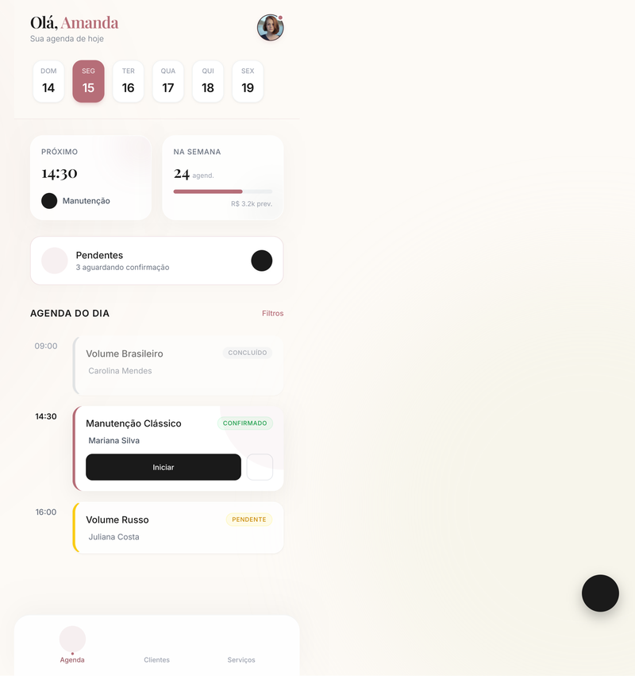
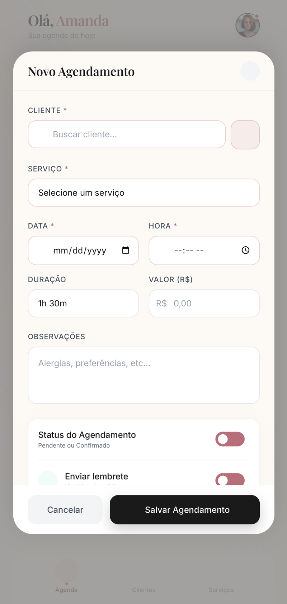
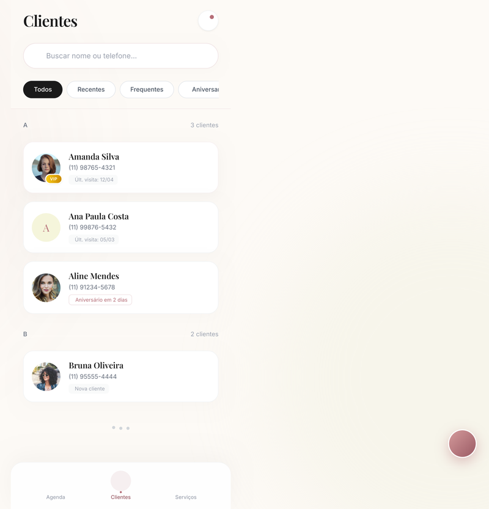
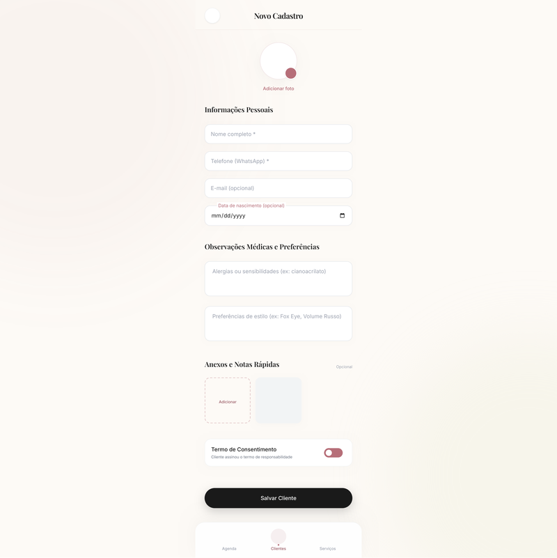
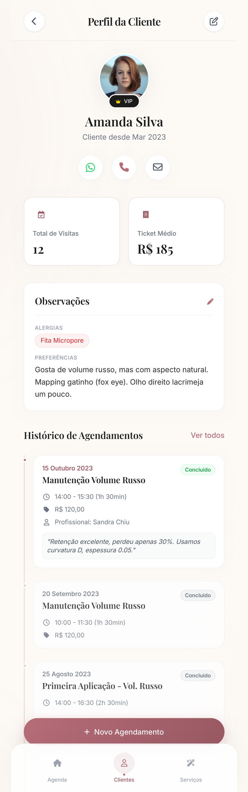
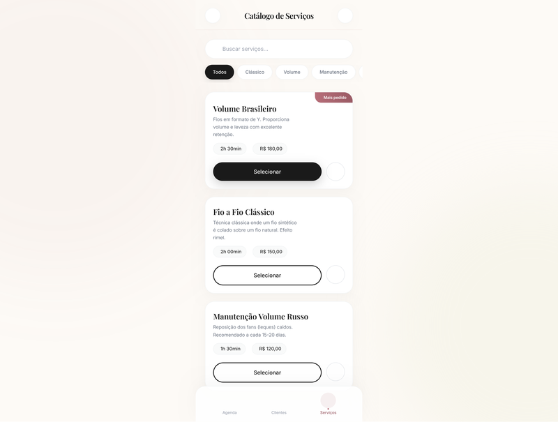

# Projeto de Interface

<span style="color:red">Pré-requisitos: <a href="02-Especificação do Projeto.md"> Especificação do Projeto</a></span>

Esta seção apresenta a visão geral da interação do usuário com as funcionalidades que fazem parte do sistema sociotécnico desenvolvido. O aplicativo foi pensado a partir das necessidades da empreendedora parceira (Ivinah Sousa), profissional autônoma da área de estética, e tem como objetivo centralizar o gerenciamento de agendamentos, o cadastro de clientes e o catálogo de serviços oferecidos pelo estúdio.

A interface foi projetada com foco em **simplicidade**, **leveza visual** e **uso em dispositivos móveis**, considerando que a profissional irá utilizar o aplicativo principalmente entre atendimentos. A paleta adotada combina tons neutros (creme, off-white, preto) com um destaque em *rose gold*, transmitindo a identidade do segmento de estética. A tipografia *Bodoni Moda* foi utilizada nos títulos para reforçar a sofisticação do produto.

## Visão Geral das Telas

A tabela a seguir descreve cada uma das telas que compõem o sistema, juntamente com a funcionalidade principal de cada uma e os requisitos funcionais atendidos.

| Tela | Descrição | Requisitos Atendidos |
|------|-----------|----------------------|
| **Login** | Permite que a empreendedora acesse o sistema utilizando e-mail e senha. Possui opção de "Manter conectado" e link para recuperação de senha. | Pré-requisito de acesso |
| **Dashboard (Agenda do Dia)** | Tela inicial após o login. Apresenta o seletor horizontal de dias da semana, cards de resumo (próximo atendimento e total de agendamentos na semana com previsão de faturamento), lista de pendências e a agenda do dia selecionado com cards de cada atendimento e seu status. | RF-005, RF-006 |
| **Novo Agendamento** | Modal/Formulário aberto a partir do botão "+ Novo agendamento". Permite selecionar cliente (com autocomplete), serviço, data e hora, visualizar a duração e o valor automaticamente preenchidos, registrar observações e definir status do agendamento. | RF-005, RF-006, RF-009 |
| **Lista de Clientes** | Lista todas as clientes cadastradas agrupadas pela letra inicial do nome. Conta com campo de busca por nome ou telefone, filtros (Todos, Recentes, Frequentes, Aniversariantes) e botão para cadastrar nova cliente. | RF-001, RF-002, RF-013 |
| **Novo Cadastro de Cliente** | Formulário completo para cadastro de uma nova cliente. Permite registrar foto, informações pessoais (nome, telefone WhatsApp, e-mail, data de nascimento), observações médicas, preferências de estilo, anexos/notas rápidas e aceitar o termo de consentimento. | RF-001, RF-004, RF-013 |
| **Perfil da Cliente** | Exibe os dados completos da cliente, com avatar, selo VIP (clientes com 10+ visitas), métricas (total de visitas e ticket médio), observações, atalhos para WhatsApp/telefone/e-mail e a linha do tempo com o histórico completo de atendimentos. Permite editar e excluir a cliente, além de criar um novo agendamento já pré-selecionando-a. | RF-003, RF-004, RF-008, RF-010, RF-011 |
| **Catálogo de Serviços** | Lista todos os serviços oferecidos pela profissional. Apresenta nome, descrição, duração, preço e selo "Mais pedido" para destacar serviços populares. Possui busca e filtros por categoria (Todos, Clássico, Volume, Manutenção) e botão para cadastrar novo serviço. | RF-009 |

## Fluxo de Navegação

O fluxo principal de navegação parte da tela de **Login** e, após autenticação, conduz a usuária para o **Dashboard**, que é o ponto de partida para as três áreas funcionais do sistema (Agenda, Clientes e Serviços), acessíveis também por meio do menu inferior fixo.

```
                     ┌──────────────────┐
                     │      Login       │
                     └────────┬─────────┘
                              │ (autenticação)
                              ▼
                     ┌──────────────────┐
        ┌────────────│    Dashboard     │────────────┐
        │            │  (Agenda do Dia) │            │
        │            └────────┬─────────┘            │
        │                     │                      │
        │   (Menu Inferior — sempre disponível)      │
        │                     │                      │
        ▼                     ▼                      ▼
┌───────────────┐    ┌─────────────────┐   ┌────────────────────┐
│   Clientes    │    │   Agendamentos  │   │ Catálogo Serviços  │
│   (Lista)     │    │   (Lista geral) │   │                    │
└───────┬───────┘    └─────────┬───────┘   └────────────────────┘
        │                      │
        ▼                      ▼
┌───────────────┐    ┌─────────────────┐
│ Perfil da     │    │ Detalhe do      │
│ Cliente       │◄──►│ Agendamento     │
└───────────────┘    └─────────────────┘
```

Toda navegação principal entre as três áreas (Agenda, Clientes e Serviços) é feita pelo **menu inferior**, presente em todas as telas após o login, garantindo acessibilidade e baixo número de cliques para alternar entre as funcionalidades centrais do sistema.

## Wireframes

A seguir são apresentados os protótipos de alta fidelidade de cada uma das telas que compõem o sistema.

### Tela de Login

A tela de login é o ponto de entrada do aplicativo. Apresenta a identidade visual do *Studio Lash* (logo, nome e tagline "Beleza & Sofisticação") e o formulário de autenticação com campos de e-mail/telefone e senha, opção de manter conectado, recuperação de senha e link para criação de conta.


### Dashboard – Agenda do Dia

Tela principal exibida após o login. Permite à profissional visualizar rapidamente os compromissos do dia, navegar pelos próximos dias da semana (seletor horizontal), acompanhar o próximo atendimento e os totais da semana (com previsão de faturamento), além de visualizar a lista de pendências e os agendamentos do dia selecionado com indicação de status (Confirmado, Pendente, Concluído).



### Novo Agendamento

Formulário utilizado para registrar um novo atendimento. Permite buscar e selecionar a cliente, escolher o serviço (com preenchimento automático de duração e valor), informar data e hora, adicionar observações e definir o status (Pendente ou Confirmado) com possibilidade de envio de lembrete.



### Lista de Clientes

Tela que apresenta todas as clientes cadastradas, agrupadas alfabeticamente pela inicial do nome. Os cards mostram avatar, nome, telefone e indicadores especiais (selo VIP para clientes frequentes, badge de aniversariante, marcação de nova cliente). O topo da tela conta com campo de busca e filtros rápidos por categoria.



### Novo Cadastro de Cliente

Formulário completo para cadastrar uma nova cliente. Permite adicionar foto, preencher informações pessoais (nome, telefone WhatsApp, e-mail, data de nascimento), registrar observações médicas (alergias, sensibilidades) e preferências de estilo, anexar notas rápidas e confirmar o termo de consentimento antes de finalizar o cadastro.



### Perfil da Cliente

Apresenta a visão completa de uma cliente: foto, selo VIP, indicador de quando se tornou cliente, atalhos diretos para contato (WhatsApp, ligação e e-mail), métricas (total de visitas e ticket médio), observações cadastradas e a linha do tempo com o histórico completo de atendimentos. Conta também com botão fixo para criar um novo agendamento já pré-selecionando essa cliente.



### Catálogo de Serviços

Tela que centraliza todos os serviços oferecidos pela profissional. Cada card exibe o nome do serviço, descrição, duração e preço, com selos de destaque (ex: "Mais pedido") para serviços populares. O topo da tela permite buscar por nome e filtrar por categoria (Clássico, Volume, Manutenção).


