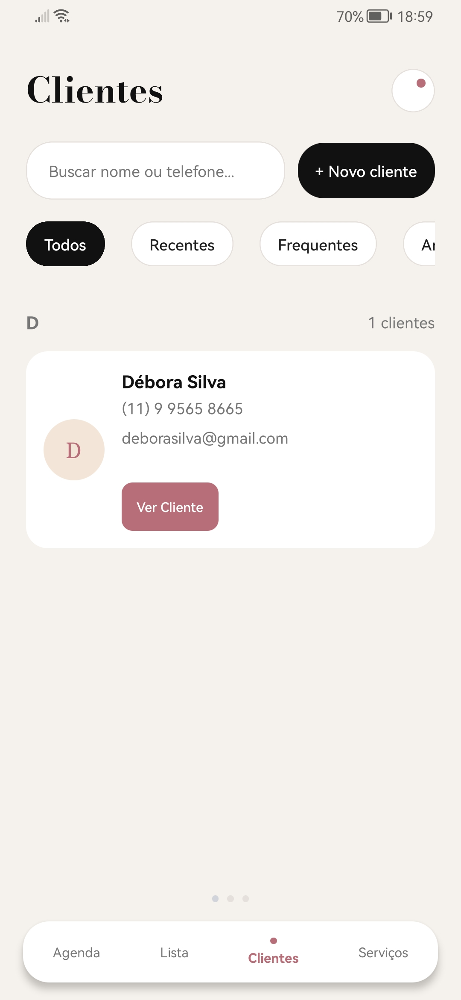
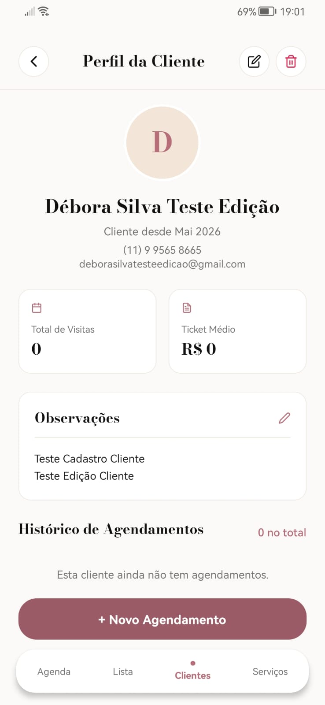
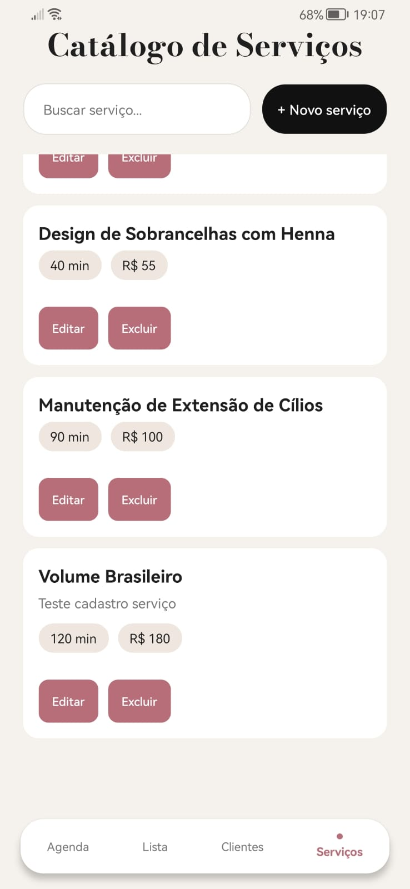
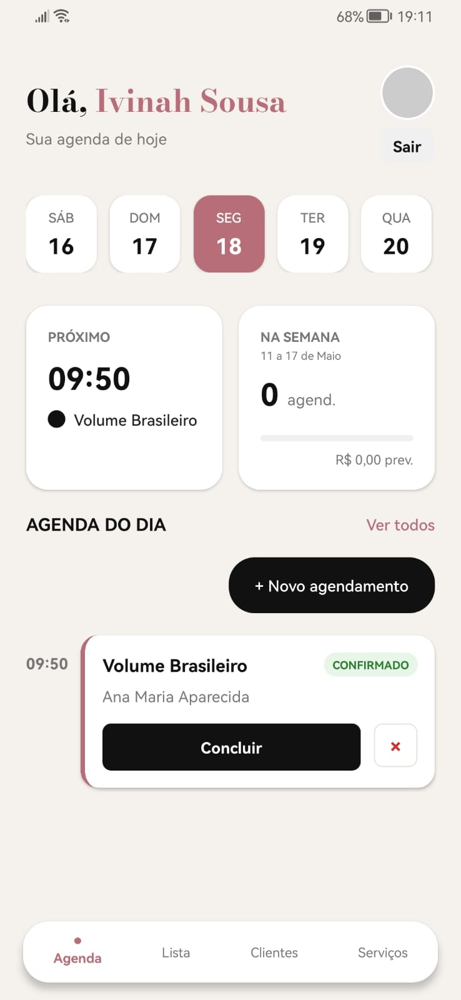
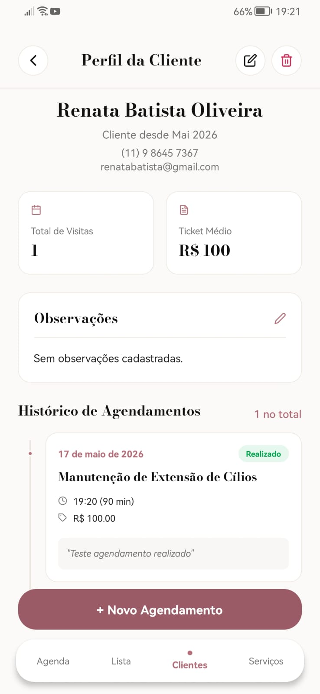
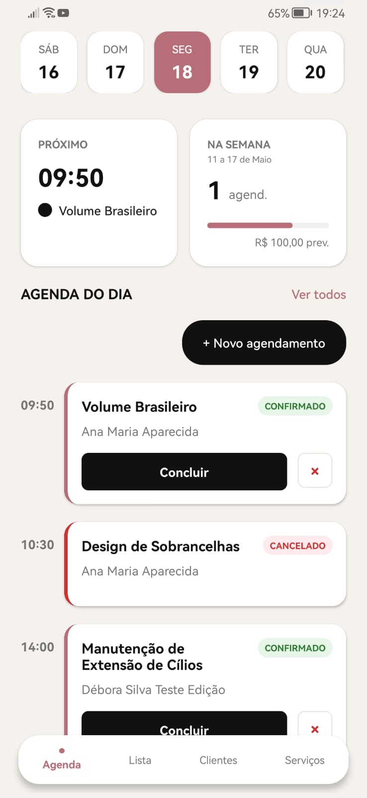

# Testes de Software

Pré-requisitos: <a href="02-Especificação do Projeto.md"> Especificação do Projeto</a>, <a href="03-Projeto de Interface.md"> Projeto de Interface</a>

# Planos de Testes de Software

Esta seção apresenta os cenários de testes que foram selecionados para validar as principais funcionalidades do aplicativo. Os cenários foram definidos a partir dos requisitos funcionais (RF) levantados na fase de especificação do projeto, de forma a garantir que as funcionalidades implementadas atendam às necessidades da empreendedora parceira (Ivinah Sousa) e aos requisitos definidos.

## Funcionalidades Avaliadas

As funcionalidades avaliadas correspondem ao escopo do MVP do sistema e estão diretamente relacionadas aos seguintes requisitos:

- Autenticação no sistema.
- Cadastro, edição, exclusão e visualização de clientes.
- Cadastro, edição e exclusão de serviços oferecidos.
- Cadastro de novo agendamento (com validações de regra de negócio).
- Visualização da agenda do dia (Dashboard) e da lista geral de agendamentos com filtros.
- Conclusão e cancelamento de agendamentos.
- Visualização do histórico de atendimentos de cada cliente.

## Grupo de Usuários

O grupo de usuários selecionado para participar dos testes foi composto por:

| Grupo | Perfil | Participação |
|-------|--------|--------------|
| **Equipe de desenvolvimento** | Estudantes responsáveis pelo desenvolvimento do sistema (Alana Alves Maia, Rodrigo da Costa Souza e Tatiana Haveroth Barbosa) | Execução dos testes funcionais durante o desenvolvimento e antes da entrega da release. |
| **Empreendedora parceira** | Ivinah Sousa – Lash Designer, usuária final do sistema. | Validação dos fluxos principais sob a perspectiva de uso real, com base na sua rotina de atendimentos. |

Como o projeto consiste em um MVP voltado, inicialmente, para uma única usuária (a empreendedora parceira), o foco dos testes foi a validação das funcionalidades essenciais sob a perspectiva da profissional que utilizará o sistema em sua rotina.

## Ferramentas Utilizadas

| Ferramenta | Finalidade |
|------------|------------|
| **Expo / React Native** | Execução da aplicação mobile em modo de desenvolvimento (web e mobile) para validação manual dos fluxos. |
| **.NET / ASP.NET Core** | Execução do backend da aplicação para validação ponta a ponta dos endpoints. |
| **Swagger** | Inspeção manual e validação dos endpoints REST consumidos pelo aplicativo. |
| **Postman** | Apoio na validação de requisições HTTP e respostas da API durante os testes. |
| **Navegador (Chrome/Edge)** | Execução do front-end via Expo Web para captura de evidências. |
| **DevTools do navegador** | Inspeção de requisições de rede e console durante a execução dos testes. |
| **Ferramenta de captura de tela do Windows** | Geração das evidências dos testes executados. |

## Cenários de Testes

A seguir são apresentados os cenários de teste selecionados. Cada caso de teste relaciona-se diretamente a um ou mais requisitos funcionais definidos na especificação do projeto.

| **Caso de Teste** | **CT01 – Realizar login no sistema** |
|:---:|:---:|
| Requisito Associado | Pré-requisito de acesso à aplicação. |
| Objetivo do Teste | Verificar se a usuária consegue acessar o sistema utilizando suas credenciais válidas e se o acesso é negado para credenciais inválidas. |
| Passos | 1. Abrir o aplicativo.   2. Na tela de login, preencher os campos "E-mail" e "Senha" com credenciais válidas.   3. Clicar no botão "Entrar".   4. Realizar logout.   5. Tentar fazer login novamente com uma senha incorreta. |
| Critério de Êxito | A usuária é redirecionada para o Dashboard ao informar credenciais válidas. Ao informar credenciais inválidas, é exibida a mensagem "E-mail ou senha inválidos." e a usuária permanece na tela de login. |

| **Caso de Teste** | **CT02 – Cadastrar nova cliente** |
|:---:|:---:|
| Requisito Associado | RF-001 – Permitir que a usuária cadastre novas clientes no sistema.   RF-004 – Permitir registrar observações ou anotações sobre a cliente.   RF-013 – Permitir registrar a data de aniversário da cliente. |
| Objetivo do Teste | Verificar se a usuária consegue cadastrar uma nova cliente com todos os dados solicitados (nome, telefone, e-mail, data de nascimento e observações). |
| Passos | 1. No menu inferior, acessar a tela "Clientes".   2. Clicar no botão "+ Novo cliente".   3. Preencher o campo "Nome *" (obrigatório).   4. Preencher os campos opcionais: Telefone, E-mail, Data de Nascimento e Observações.   5. Clicar em "Salvar cliente". |
| Critério de Êxito | A nova cliente é cadastrada com sucesso, o formulário é fechado e a cliente aparece na listagem agrupada pela letra inicial do seu nome. |

| **Caso de Teste** | **CT03 – Editar dados de uma cliente cadastrada** |
|:---:|:---:|
| Requisito Associado | RF-003 – Permitir editar as informações de uma cliente cadastrada.   RF-004 – Permitir registrar observações ou anotações sobre a cliente. |
| Objetivo do Teste | Verificar se a usuária consegue alterar as informações de uma cliente já existente. |
| Passos | 1. Acessar a tela "Clientes".   2. Clicar em "Ver Cliente" no card de uma cliente da lista.   3. Na tela "Perfil da Cliente", clicar no ícone de edição (lápis).   4. Alterar um ou mais campos (ex: telefone, observações).   5. Clicar em "Salvar alterações". |
| Critério de Êxito | As alterações são persistidas e os novos dados aparecem corretamente na tela de perfil da cliente. |

| **Caso de Teste** | **CT04 – Listar clientes com busca e filtros** |
|:---:|:---:|
| Requisito Associado | RF-002 – Permitir visualizar a lista de clientes cadastradas.   RF-010 – Permitir visualizar os dados de contato da cliente. |
| Objetivo do Teste | Verificar se a lista de clientes é exibida corretamente, agrupada pela letra inicial, e se a busca por nome ou telefone funciona como esperado. |
| Passos | 1. Acessar a tela "Clientes".   2. Verificar se as clientes estão agrupadas por inicial em ordem alfabética.   3. Digitar um nome (parcial ou completo) no campo de busca.   4. Apagar o conteúdo da busca e digitar parte de um número de telefone. |
| Critério de Êxito | A lista exibe corretamente as clientes agrupadas e os filtros de busca retornam apenas as clientes que correspondem ao termo digitado (por nome ou telefone). |

| **Caso de Teste** | **CT05 – Cadastrar novo serviço no catálogo** |
|:---:|:---:|
| Requisito Associado | RF-009 – Permitir cadastrar diferentes tipos de serviços ou procedimentos. |
| Objetivo do Teste | Verificar se a usuária consegue cadastrar um novo serviço informando nome, descrição, preço e duração. |
| Passos | 1. No menu inferior, acessar a tela "Serviços".   2. Clicar em "+ Novo serviço".   3. Preencher os campos: Nome (ex: "Volume Brasileiro"), Descrição, Preço (ex: 180) e Duração em minutos (ex: 120).   4. Clicar em "Salvar serviço". |
| Critério de Êxito | O serviço é cadastrado e aparece na lista do catálogo com os dados informados (duração e preço visíveis no card). |

| **Caso de Teste** | **CT06 – Cadastrar novo agendamento** |
|:---:|:---:|
| Requisito Associado | RF-005 – Permitir registrar um novo agendamento para uma cliente.   RF-006 – Permitir visualizar os agendamentos cadastrados na agenda. |
| Objetivo do Teste | Verificar se a usuária consegue criar um novo agendamento para uma cliente cadastrada, selecionando um serviço existente e informando data, hora e observações válidas. |
| Passos | 1. No Dashboard, clicar em "+ Novo agendamento".   2. Digitar o nome da cliente no campo "Cliente *" e selecioná-la na lista de sugestões (autocomplete).   3. Digitar o nome do serviço no campo "Serviço *" e selecioná-lo.   4. Preencher o campo "Data e Hora *" no formato DD/MM/AAAA HH:MM (data futura, em horário comercial).   5. Adicionar uma observação opcional.   6. Clicar em "Salvar Agendamento". |
| Critério de Êxito | O novo agendamento é salvo com sucesso e passa a ser exibido no Dashboard no dia correspondente, com o status "CONFIRMADO" e o serviço/cliente selecionados. |

| **Caso de Teste** | **CT07 – Validar regras de negócio do agendamento** |
|:---:|:---:|
| Requisito Associado | RF-005 – Permitir registrar um novo agendamento para uma cliente. |
| Objetivo do Teste | Verificar se o sistema valida corretamente as regras de negócio do agendamento (campos obrigatórios, data no passado, fora do expediente e horário ocupado). |
| Passos | 1. Abrir o formulário de novo agendamento.   2. Tentar salvar sem preencher cliente/serviço/data.   3. Informar uma data e hora no passado.   4. Informar um horário fora do expediente (ex: 06:00 ou 22:00).   5. Informar um horário em que já existe um agendamento confirmado para o mesmo dia. |
| Critério de Êxito | O sistema exibe mensagens de erro inline para cada caso: "Selecione uma cliente", "Selecione um serviço", "Não é possível agendar no passado", "Fora do expediente (08:00–20:00)" e "Já existe um agendamento neste horário". |

| **Caso de Teste** | **CT08 – Marcar agendamento como realizado** |
|:---:|:---:|
| Requisito Associado | RF-007 – Permitir registrar o histórico de atendimentos realizados. |
| Objetivo do Teste | Verificar se a usuária consegue marcar um agendamento agendado como realizado e se ele é incluído no histórico da cliente. |
| Passos | 1. No Dashboard, localizar um agendamento com status "CONFIRMADO".   2. Clicar em "Concluir" no card do agendamento (ou abrir o detalhe e clicar em "Marcar como realizado").   3. Confirmar a ação no diálogo.   4. Acessar a tela "Perfil da Cliente" correspondente. |
| Critério de Êxito | O agendamento muda para status "REALIZADO", é contabilizado no total de visitas da cliente, é exibido no histórico de atendimentos e contribui para o cálculo do ticket médio. |

| **Caso de Teste** | **CT09 – Cancelar um agendamento** |
|:---:|:---:|
| Requisito Associado | RF-006 – Permitir visualizar os agendamentos cadastrados na agenda. |
| Objetivo do Teste | Verificar se a usuária consegue cancelar um agendamento ativo e se ele passa a ser exibido com o status correto. |
| Passos | 1. No Dashboard, localizar um agendamento com status "CONFIRMADO".   2. Clicar no botão "×" no card do agendamento (ou abrir o detalhe e clicar em "Cancelar agendamento").   3. Confirmar a ação. |
| Critério de Êxito | O agendamento muda para status "CANCELADO" e passa a ser exibido com a borda vermelha, deixando de ocupar o horário para fins de validação. |

| **Caso de Teste** | **CT10 – Visualizar histórico de atendimentos da cliente** |
|:---:|:---:|
| Requisito Associado | RF-008 – Permitir consultar o histórico de atendimentos de uma cliente. |
| Objetivo do Teste | Verificar se a tela "Perfil da Cliente" exibe corretamente o histórico de agendamentos da cliente, com os status corretos e as métricas calculadas. |
| Passos | 1. Acessar a tela "Clientes".   2. Selecionar uma cliente que possua agendamentos.   3. No "Perfil da Cliente", verificar os cards de Total de Visitas e Ticket Médio.   4. Conferir a linha do tempo "Histórico de Agendamentos". |
| Critério de Êxito | A tela exibe corretamente o total de visitas (somente realizados), o ticket médio (preço médio dos serviços realizados) e a lista de agendamentos da cliente em ordem cronológica, com status indicados (Agendado, Realizado, Cancelado). |

| **Caso de Teste** | **CT11 – Filtrar agendamentos por status** |
|:---:|:---:|
| Requisito Associado | RF-006 – Permitir visualizar os agendamentos cadastrados na agenda. |
| Objetivo do Teste | Verificar se a tela "Agendamentos" permite filtrar os registros por status corretamente. |
| Passos | 1. Acessar a tela "Agendamentos" (a partir do Dashboard, em "Ver todos").   2. Aplicar cada um dos filtros disponíveis: Todos, Agendados, Realizados e Cancelados. |
| Critério de Êxito | A lista é atualizada corretamente a cada filtro, exibindo apenas os agendamentos com o status selecionado. |

| **Caso de Teste** | **CT12 – Excluir cliente cadastrada** |
|:---:|:---:|
| Requisito Associado | RF-003 – Permitir editar as informações de uma cliente cadastrada. |
| Objetivo do Teste | Verificar se a usuária consegue excluir uma cliente da base, com confirmação prévia. |
| Passos | 1. Acessar o "Perfil da Cliente".   2. Clicar no ícone da lixeira no canto superior direito.   3. Confirmar a exclusão no diálogo. |
| Critério de Êxito | A cliente é removida da base e a usuária é redirecionada para a lista de Clientes, onde a cliente não aparece mais. |

# Evidências de Testes de Software

Esta seção apresenta as evidências (capturas de tela) que comprovam que cada um dos testes descritos no Plano de Testes foi executado e teve o resultado esperado verificado. As capturas foram obtidas durante a execução manual dos casos de teste pela equipe, utilizando a aplicação em modo de desenvolvimento (Expo Web + Backend .NET).

> **Observação:** As evidências serão adicionadas após a execução manual de cada caso de teste em ambiente de produção. As imagens devem ser salvas na pasta `documents/img/evidencias/` com os nomes indicados em cada seção abaixo.

| **Caso de Teste** | **CT01 – Realizar login no sistema** |
|:---:|:---:|
| Requisito Associado | Pré-requisito de acesso à aplicação. |
| Resultado |  |
| Registro de evidência |  |

| **Caso de Teste** | **CT02 – Cadastrar nova cliente** |
|:---:|:---:|
| Requisito Associado | RF-001, RF-004, RF-013 |
| Resultado |  |
| Registro de evidência |  |

| **Caso de Teste** | **CT03 – Editar dados de uma cliente cadastrada** |
|:---:|:---:|
| Requisito Associado | RF-003, RF-004 |
| Resultado |  |
| Registro de evidência |  |

| **Caso de Teste** | **CT04 – Listar clientes com busca e filtros** |
|:---:|:---:|
| Requisito Associado | RF-002, RF-010 |
| Resultado |  |
| Registro de evidência |  |

| **Caso de Teste** | **CT05 – Cadastrar novo serviço no catálogo** |
|:---:|:---:|
| Requisito Associado | RF-009 |
| Resultado |  |
| Registro de evidência |  |

| **Caso de Teste** | **CT06 – Cadastrar novo agendamento** |
|:---:|:---:|
| Requisito Associado | RF-005, RF-006 |
| Resultado |  |
| Registro de evidência |  |

| **Caso de Teste** | **CT07 – Validar regras de negócio do agendamento** |
|:---:|:---:|
| Requisito Associado | RF-005 |
| Resultado |  |
| Registro de evidência |  |

| **Caso de Teste** | **CT08 – Marcar agendamento como realizado** |
|:---:|:---:|
| Requisito Associado | RF-007 |
| Resultado |  |
| Registro de evidência |  |

| **Caso de Teste** | **CT09 – Cancelar um agendamento** |
|:---:|:---:|
| Requisito Associado | RF-006 |
| Resultado |  |
| Registro de evidência |  |

| **Caso de Teste** | **CT10 – Visualizar histórico de atendimentos da cliente** |
|:---:|:---:|
| Requisito Associado | RF-008 |
| Resultado |  |
| Registro de evidência |  |

| **Caso de Teste** | **CT11 – Filtrar agendamentos por status** |
|:---:|:---:|
| Requisito Associado | RF-006 |
| Resultado |  |
| Registro de evidência |  |

| **Caso de Teste** | **CT12 – Excluir cliente cadastrada** |
|:---:|:---:|
| Requisito Associado | RF-003 |
| Resultado |  |
| Registro de evidência |  |
